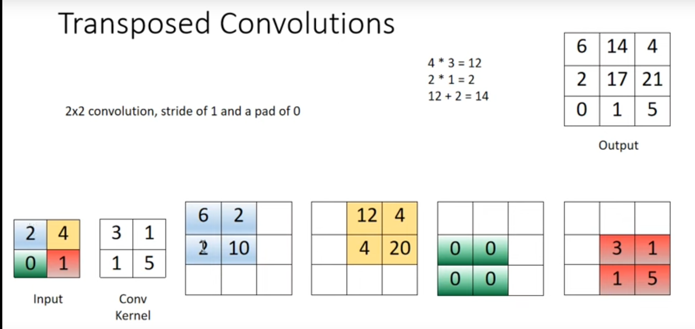
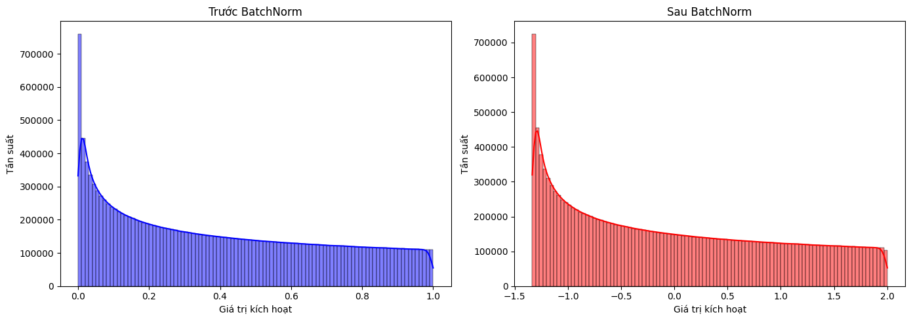

# Các kiến thức cần ngoài lề cần thiết khi xây dựng kiến trúc UNet

### 1. Histogram và đường KDE:

[Histogram và KDE](essential/histogram_kde.ipynb)

 **a. Kernel Density Estimation (KDE) là gì?**  
KDE (**Ước lượng mật độ hạt nhân**) là một phương pháp thống kê để ước lượng **hàm mật độ xác suất** (Probability Density Function - PDF) của một tập dữ liệu.  

Nói đơn giản, KDE giúp bạn thấy **phân phối thực sự** của dữ liệu thay vì chỉ dựa vào biểu đồ cột (histogram).  

Ví dụ:  
- Histogram chia dữ liệu thành từng nhóm (bins) và đếm số lượng điểm trong mỗi nhóm.  
- KDE vẽ một **đường cong liên tục** mô tả xác suất xuất hiện của từng giá trị.  

  
_(Hình minh họa: Histogram vs KDE)_  

---

 **b. Cách KDE hoạt động?**  
KDE sử dụng **hạt nhân (kernel)** – một hàm toán học giúp ước lượng mật độ của từng điểm dữ liệu. Công thức tổng quát của KDE:  

\[
\hat{f}(x) = \frac{1}{n h} \sum_{i=1}^{n} K\left(\frac{x - x_i}{h}\right)
\]

Trong đó:  
- \( \hat{f}(x) \) là ước lượng mật độ tại điểm \( x \).  
- \( n \) là số lượng mẫu dữ liệu.  
- \( h \) là **băng thông (bandwidth)**, xác định độ mượt của đường KDE.  
- \( K(\cdot) \) là **hàm hạt nhân (kernel function)**, thường là một hàm chuẩn như:  
  - Gaussian (phổ biến nhất)  
  - Epanechnikov  
  - Uniform  

**Vai trò của băng thông (bandwidth)**
- Nếu **băng thông nhỏ**, KDE có nhiều dao động, dễ bị nhiễu.  
- Nếu **băng thông lớn**, KDE trở nên quá mượt, mất chi tiết quan trọng.  

  
_(Hình minh họa: Băng thông nhỏ vs vừa vs lớn)_  

---

 **c. So sánh Histogram và KDE**
| Đặc điểm | Histogram | KDE |
|----------|------------|------------|
| Dạng biểu diễn | Cột rời rạc | Đường cong liên tục |
| Phụ thuộc vào bins | Có | Không |
| Ảnh hưởng bởi nhiễu | Ít (nhưng bị chia theo bins) | Có thể bị nhiễu nếu bandwidth nhỏ |
| Thể hiện phân phối | Thô sơ | Mượt hơn, dễ quan sát |

👉 **Histogram phù hợp khi cần đếm số lượng**  
👉 **KDE phù hợp khi muốn hiểu rõ hơn về phân phối thực sự của dữ liệu**  

### 2. upconv `nn.ConvTranspose2d`:
```python
def upconv_block(self, in_channels, out_channels):
    return nn.ConvTranspose2d(in_channels, out_channels, kernel_size=2, stride=2)
```




### 3. crop image `Crop tensor`:
```python
def crop_tensor(self, tensor, target_size):
    _, _, H, W = tensor.size()
    diffY = (H - target_size[0]) // 2
    diffX = (W - target_size[1]) // 2
    return tensor[:, :, diffY:(diffY + target_size[0]), diffX:(diffX + target_size[1])]
```

- Hàm trên sẽ cắt các phần dư thừa của tensor được truyển vào sao cho có size giống với target_size

**Giải thích về: `dec1.shape[2:]`:**

- dec1.shape có dạng $(batch_size, channels, height, width)$.

- `dec1.shape[2:]` trả về một tuple chứa hai giá trị: $(height, width)$ của tensor dec1.

- Ví dụ: Nếu dec1 có kích thước $(1, 64, 388, 388)$, thì `dec1.shape[2:]` sẽ trả về $(388, 388)$.


### 4. `torch.cat()`:
```python
torch.cat((dec4, enc4), dim=1)
```

- Gộp 2 dec4 và enc4 lại theo chiều 1 (tức là tăng số lượng channel lên).


### 5.  `nn.BatchNorm2d()`:

**Batch Normalization là gì?**  

Batch Normalization (BatchNorm) là một kỹ thuật chuẩn hóa dữ liệu đầu vào tại mỗi lớp của mạng nơ-ron để cải thiện hiệu suất và tốc độ huấn luyện. Nó giúp ổn định quá trình huấn luyện bằng cách giảm sự thay đổi của các phân phối đầu vào, làm cho mô hình học nhanh hơn và tổng quát tốt hơn.

---

**Cách hoạt động của BatchNorm**  

Giả sử ta có đầu vào $x$ với kích thước $(batch\_size, channels, height, width)$. BatchNorm thực hiện các bước sau trên mỗi kênh riêng lẻ:

**Tính trung bình (mean)** của từng kênh:  $\mu_B = \frac{1}{m} \sum_{i=1}^{m} x_i$.

- Trong đó $m$ là số lượng mẫu trong batch.

**Tính phương sai (variance)** của từng kênh: $\sigma_B^2 = \frac{1}{m} \sum_{i=1}^{m} (x_i - \mu_B)^2$.

- Điều này đo lường mức độ phân tán của dữ liệu trong batch.

**Chuẩn hóa dữ liệu** bằng cách đưa về phân phối có trung bình 0 và phương sai 1: $\hat{x}_i = \frac{x_i - \mu_B}{\sqrt{\sigma_B^2 + \epsilon}}$.

- Trong đó $\epsilon$ là một số rất nhỏ để tránh chia cho 0.

**Thêm tham số trainable (scale & shift)**:  $y_i = \gamma \hat{x}_i + \beta$.

- $\gamma$ (scale) và $\beta$ (shift) là các tham số học được, giúp BatchNorm có thể khôi phục lại khả năng biểu diễn ban đầu nếu cần.

**Ví dụ về cách hoạt động của `nn.BatchNorm2d(out_channels)`**
```python
import torch
import torch.nn as nn
import matplotlib.pyplot as plt
import seaborn as sns

batch_size = 1000  # Tăng batch_size để có phân phối tốt hơn
out_channels = 16
height, width = 32, 32

# Lớp BatchNorm2d
bn = nn.BatchNorm2d(out_channels)

# Tạo dữ liệu giả với phân phối không đồng đều (phân bố lệch trái, exponential)
x = torch.rand(batch_size, out_channels, height, width) ** 1.5  # Nâng lũy thừa để tạo phân bố lệch

# Áp dụng BatchNorm
output = bn(x)

print(output.shape)

def plot_distribution(ax, data, title, color):
    """Hàm vẽ biểu đồ phân phối của dữ liệu trên subplot"""
    data_flat = data.view(-1).detach().numpy()
    sns.histplot(data_flat, bins=100, kde=True, color=color, ax=ax)
    ax.set_title(title)
    ax.set_xlabel('Giá trị kích hoạt')
    ax.set_ylabel('Tần suất')

# Tạo figure và subplot
fig, axes = plt.subplots(1, 2, figsize=(14, 5))

# Vẽ biểu đồ trước và sau BatchNorm trên các subplot khác nhau
plot_distribution(axes[0], x, 'Trước BatchNorm', 'blue')
plot_distribution(axes[1], output, 'Sau BatchNorm', 'red')

plt.tight_layout()
plt.show()
```
**Output:**
> torch.Size([1000, 16, 32, 32])


 **Ảnh hưởng của BatchNorm đến phân phối dữ liệu**
- Trước BatchNorm: Dữ liệu có thể có bất kỳ dạng phân phối nào (phân bố lệch, phân bố dốc, v.v.).  
- Sau BatchNorm: Dữ liệu được chuyển về dạng **phân phối chuẩn hơn** với trung bình xấp xỉ `0` và phương sai `1`.

 **Lợi ích của Batch Normalization**
1. **Giúp huấn luyện nhanh hơn**: Do dữ liệu được chuẩn hóa, mô hình có thể học nhanh hơn và giảm sự cần thiết của learning rate thấp.  
2. **Ổn định quá trình huấn luyện**: Tránh tình trạng "Exploding Gradients" hoặc "Vanishing Gradients".  
3. **Giảm phụ thuộc vào khởi tạo trọng số**: Vì dữ liệu đầu vào đã được chuẩn hóa, mô hình ít nhạy cảm hơn với cách khởi tạo ban đầu.  
4. **Tổng quát hóa tốt hơn**: BatchNorm giúp mô hình tránh bị overfitting nhờ tác dụng tương tự dropout.  


### 6. 