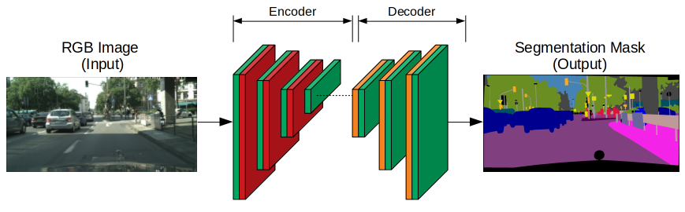
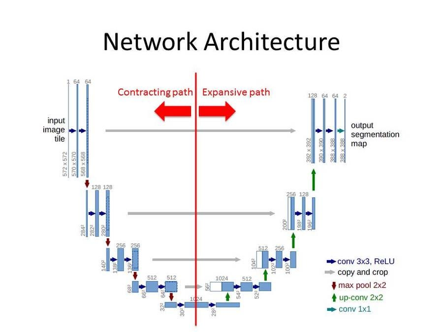

# Giải thích về kiến trúc UNet và cách cài đặt.

## Phần I: Giới thiệu

### 1. UNet là gì?
UNet là một mô hình deep learning thuộc kiến trúc CNN (Convolution Neural Network), được thiết kế đặc biệt cho các tác vụ phân đoạn ảnh (image segmentation).



**Hình 1:** Minh họa về mô hình UNet và ví dụ về image segmentation.

### 2. Kiến trúc của UNet
Kiến trúc UNet có hình dáng giống chữ "U", gồm 2 phần chính:

#### 2.1. Encoder (Contraction Path)
- Gồm các **convolution layer** và **pooling layer** để giảm kích thước không gian của ảnh và tăng số lượng đặc trưng (feature maps).

- Giúp trích xuất các đặc trưng quan trọng.

#### 2.2. Decoder (Expansion Path)
- Sử dụng các lớp **upsampling (deconvolution)** để khôi phục kích thước ban đầu của ảnh.

- Kết hợp với các đặc trưng từ Encoder (**skip connections**) giúp tái tạo chi tiết tốt hơn.



**Hình 2:** Cấu trúc kiến trúc UNet.

### 3. Đặc điểm nổi bật
- **Skip connections:** Giúp giữ lại thông tin chi tiết từ các lớp ban đầu và cải thiện kết quả phân đoạn.
  
- **Không yêu cầu quá nhiều dữ liệu:** Do kiến trúc đối xứng và cách tận dụng dữ liệu hiệu quả.
  
- **Ứng dụng trong phân đoạn ảnh y khoa:** Được thiết kế ban đầu cho lĩnh vực y tế, như phân đoạn tế bào, mô bệnh, não MRI, v.v.

### 4. Ứng dụng của UNet
- **Y tế:** Phân đoạn hình ảnh y khoa như X-ray, MRI, CT Scan.
  
- **Viễn thám:** Phân tích ảnh vệ tinh, bản đồ địa lý.
- **Nghệ thuật và xử lý ảnh:** Tạo bản đồ sâu (depth maps), tách nền.

UNet vẫn là một trong những kiến trúc m ạnh mẽ nhất cho phân đoạn ảnh và có nhiều biến thể như **UNet++**, **Attention UNet**, **3D UNet**,... để cải thiện hiệu suất.

---

## Phần II: Mô tả chi tiết
### 1. Ví dụ về mô hình UNet:
Dưới đây là một đoạn code cơ bản sử dụng kiến trúc UNet trong PyTorch. UNet là một kiến trúc mạng nơ-ron phổ biến trong các bài toán phân đoạn ảnh (image segmentation).

```python
import torch
import torch.nn as nn
import torch.nn.functional as F

class UNet(nn.Module):
    def __init__(self, in_channels, out_channels):
        super(UNet, self).__init__()
        
        # Encoder
        self.encoder1 = self.conv_block(in_channels, 64)
        self.encoder2 = self.conv_block(64, 128)
        self.encoder3 = self.conv_block(128, 256)
        self.encoder4 = self.conv_block(256, 512)
        
        # Bottleneck
        self.bottleneck = self.conv_block(512, 1024)
        
        # Decoder
        self.upconv4 = self.upconv_block(1024, 512)
        self.decoder4 = self.conv_block(1024, 512)
        self.upconv3 = self.upconv_block(512, 256)
        self.decoder3 = self.conv_block(512, 256)
        self.upconv2 = self.upconv_block(256, 128)
        self.decoder2 = self.conv_block(256, 128)
        self.upconv1 = self.upconv_block(128, 64)
        self.decoder1 = self.conv_block(128, 64)
        
        # Final layer
        self.final_conv = nn.Conv2d(64, out_channels, kernel_size=1)
        
    def conv_block(self, in_channels, out_channels):
        return nn.Sequential(
            nn.Conv2d(in_channels, out_channels, kernel_size=3, padding=1),
            nn.BatchNorm2d(out_channels),
            nn.ReLU(inplace=True),
            nn.Conv2d(out_channels, out_channels, kernel_size=3, padding=1),
            nn.BatchNorm2d(out_channels),
            nn.ReLU(inplace=True)
        )
    
    def upconv_block(self, in_channels, out_channels):
        return nn.ConvTranspose2d(in_channels, out_channels, kernel_size=2, stride=2)
    
    def crop_tensor(self, tensor, target_size):
        _, _, H, W = tensor.size()
        diffY = (H - target_size[0]) // 2
        diffX = (W - target_size[1]) // 2
        return tensor[:, :, diffY:(diffY + target_size[0]), diffX:(diffX + target_size[1])]
    
    def forward(self, x):
        # Encoder
        enc1 = self.encoder1(x)
        enc2 = self.encoder2(F.max_pool2d(enc1, 2))
        enc3 = self.encoder3(F.max_pool2d(enc2, 2))
        enc4 = self.encoder4(F.max_pool2d(enc3, 2))
        
        # Bottleneck
        bottleneck = self.bottleneck(F.max_pool2d(enc4, 2))
        
        # Decoder
        dec4 = self.upconv4(bottleneck)
        enc4 = self.crop_tensor(enc4, dec4.shape[2:])
        dec4 = torch.cat((dec4, enc4), dim=1)
        dec4 = self.decoder4(dec4)
        
        dec3 = self.upconv3(dec4)
        enc3 = self.crop_tensor(enc3, dec3.shape[2:])
        dec3 = torch.cat((dec3, enc3), dim=1)
        dec3 = self.decoder3(dec3)
        
        dec2 = self.upconv2(dec3)
        enc2 = self.crop_tensor(enc2, dec2.shape[2:])
        dec2 = torch.cat((dec2, enc2), dim=1)
        dec2 = self.decoder2(dec2)
        
        dec1 = self.upconv1(dec2)
        enc1 = self.crop_tensor(enc1, dec1.shape[2:])
        dec1 = torch.cat((dec1, enc1), dim=1)
        dec1 = self.decoder1(dec1)
        
        # Final layer
        out = self.final_conv(dec1)
        
        return out

# Kiểm tra xem GPU có sẵn không
device = torch.device("cuda:0" if torch.cuda.is_available() else "cpu")
print(f"Using device: {device}")

# Tạo mô hình và di chuyển sang GPU
model = UNet(in_channels=1, out_channels=1).to(device)

# Tạo dữ liệu đầu vào và di chuyển sang GPU
x = torch.randn((1, 1, 572, 572)).to(device)

# Chạy mô hình
output = model(x)
print(output.shape)  # Kích thước đầu ra: (1, 1, 388, 388)
```

#### Giải thích sơ qua:
- **Encoder**: Phần encoder bao gồm các khối convolution (`conv_block`) và max pooling để giảm kích thước không gian của ảnh và tăng số lượng kênh (channels).
- **Bottleneck**: Đây là phần nằm giữa encoder và decoder, thường là một khối convolution với số lượng kênh lớn nhất.
- **Decoder**: Phần decoder sử dụng các khối up-convolution (`upconv_block`) để tăng kích thước không gian của ảnh và giảm số lượng kênh. Các kết nối skip (skip connections) được sử dụng để kết hợp thông tin từ encoder tương ứng.
- **Final layer**: Lớp convolution cuối cùng để ánh xạ số lượng kênh đầu ra thành số lớp cần phân đoạn.

#### Lưu ý:
- Kích thước đầu vào và đầu ra của UNet phụ thuộc vào kích thước của ảnh đầu vào và số lượng lớp cần phân đoạn.
- Bạn có thể điều chỉnh số lượng kênh, số lượng lớp, và các tham số khác để phù hợp với bài toán cụ thể của mình.


### 2. Bản vẽ tay giải thích về UNet và các layer.


### 3. U-Net for Building Segmenttation - PyTorch (Kaggle)
- [link](https://www.kaggle.com/code/balraj98/unet-for-building-segmentation-pytorch)

### 4. Unet Architecture image segmentation
- [UNet (Jupyter notebook)](unet/UNet.ipynb)


---

## Phần III: Cách cài đặt UNet bằng PyTorch

