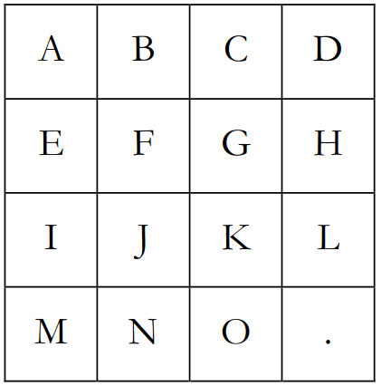

### NPUZZLE

N-puzzle là một câu đố có nhiều biến tên và biến thể khác nhau. Trong bài này chúng ta chỉ quan tâm đến biến thể 15-puzzle. Nó bao gồm một lưới $4 \times 4$ các ô trượt, trong số đó có một ô vuông bị thiếu. Các ô vuông được gán nhãn bằng các chữ cái in hoa từ 'A' đến 'O' với bố cục mon muốn là như sau:



Ta định nghĩa **"độ phân tán** của câu đố là tổng của các khoảng cách giữa những ô hiện tại và vị trí mong muốn của các ô đó. Khoảng cách giữa hai ô vuông được tính theo **khoảng cách Manhattan** (tức là khoảng cách Manhattan giữa 2 ô $(x, y)$ và $(u, v)$ là $|x - u| + |y - v|$).

Viết một chương trình tính độ phân tán của câu đố bạn nhận được.


#### Input:
- Gồm 4 dòng, mỗi dòng chứa 4 kí tự biểu diễn trạng thái của câu đố.

#### Output:
- Dữ liệu đầu ra gồm một dòng duy nhất là độ phân tán bạn tìm được.

#### Example:

!!! question "Test 1"
    ???+ "Input"
        ```
        ABCD
        EFGH
        IJKL
        M.NO
        ```
    ???+ "Output"
        ```
        2
        ```

!!! question "Test 2"
    ???+ "Input"
        ```
        .BCD
        EAGH
        IJFL
        MNOK
        ```
    ???+ "Output"
        ```
        6
        ```
        