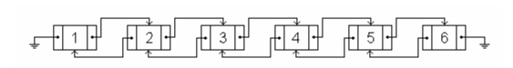

### LISTA

Mirko nhận được món quà sinh nhật từ dì của mình ở Mỹ, món quà là một danh sách liên kết đôi hoàn toàn mới. Danh sách này chứa $N$ nút, được đánh số từ $1$ đến $N$. Có hai loại thao tác trên danh sách:

- A: Di chuyển nút $X$ đến trước nút $Y$.
- B: Di chuyển nút $X$ ra sau nút $Y$.



- Ví dụ về danh sách liên kết đôi với 6 nút.
 


- Danh sách sau thao tác `A 1 4`. 


- Danh sách sau thao tác `B 3 5`.

Mirko đã chơi chúng trong nhiều giờ, và ghi lại từng thao tác trên một tờ giấy để có thể khôi phục lại trạng thái ban đầu (các nút từ $1$ đến $N$ có thứ tự từ trái qua phải).

Khi cậu ấy quyết định khôi phục lại danh sách, Mirko ngạc nhiên khi nhận ra rằng nó không hề dễ để đảo ngược các thao tác và khổi phục lại trạng thái ban đầu. Mirko công thể biết vị trí vị trí ban đầu của nút X trước mỗi thao tác mà chỉ biết nó khi kết thúc thao tác.

Mirko vẫn chưa hết bàng hoàng, vì vậy hãy viết một chương trình giúp cậu ấy tìm thấy chuỗi các thao tác ngắn nhất có thể để khôi phục lại trạng thái ban đầu của danh sách từ các thao tác đã ghi lại.


#### Input:
- Dòng đầu tiên chứa hai số nguyên $N$ và $K$ $(2 \le N \le 5 \times 10^5; 0 \le M \le 10^5)$ là số lượng nút trong danh sách và số lượng thao tác mà Mirko tạo ra. 
- Mỗi dòng trong số $M$ dòng tiếp theo mô tả một thao tác mà Mirko tạo ra gồm loại thao tác (`A` hoặc `B`) và 2 số nguyên $X$ và $Y$.


#### Output:
- Dòng đầu tiên in ra số lượng thao tác ít nhất (kí hiệu là $K$) tìm được.
- Mỗi dòng trong số $K$ dòng tiếp theo in ra một thao tác (với định dạng giống như định dạng thao tác trên *Input*).
**Lưu ý:** Chuỗi thao tác có thể có nhiều đáp án.


#### Scoring: 
- Nếu cả 2 số $K$ và chuỗi các thao tác là đúng, bạn sẽ được tối đa điểm cho mỗi test. Nếu chương trình của bạn in ra đúng số $K$ và không in ra chuỗi các thao tác hoặc in ra chuỗi các thao tác bị sai, bạn sẽ nhận được $60\%$ điểm cho mỗi test.


#### Sample:

!!! question "Test 1"
    ???+ "Input"
        ```
        2 1 
        A 2 1
        ```
    ???+ "Output"
        ```
        1 
        A 1 2
        ```

!!! question "Test 1"
    ???+ "Input"
        ```
        4 3 
        B 1 2 
        A 4 3 
        B 1 4
        ```
    ???+ "Output"
        ```
        2 
        A 1 2 
        B 4 3 
        ```

!!! question "Test 2"
    ???+ "Input"
        ```
        6 5 
        A 1 4 
        B 2 5 
        B 4 2 
        B 6 3 
        A 3 5
        ```
    ???+ "Output"
        ```
        3 
        A 4 5 
        B 6 5 
        A 2 3
        ```