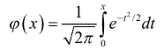

# Bài tập về nhà môn Xác suất thống kê:

- Người thực hiện: Nguyễn Trường Giang.
- MSSV: 24520011

## Bài 1. 
Bắn 3 viên đạn một cách độc lập vào một bia. Xác suất trúng bia của mỗi viên lần lượt là 0.6; 0.9; 0.7. Tìm xác suất: 

1. Có đúng một viên trúng đích.

2. Có ít nhất một viên trúng đích.


## Bài 2. 
Có 3 hộp phấn. 

- Hộp I có 15 viên tốt và 5 viên xấu; 
- Hộp II có 10 viên tốt và 4 viên xấu; 
- Hộp III có 20 viên tốt và 10 viên xấu. 
- Lấy ngẫu nhiên mỗi hộp 1 viên phấn. Tìm xác suất được ít nhất một viên phấn tốt.


## Bài 3. 
- Viết chương trình tính gần đúng số Pi

**Code:**
```cpp
#include<bits/stdc++.h>
using namespace std;
using ll = long long;

mt19937_64 rngll(chrono :: steady_clock :: now().time_since_epoch().count());
ll random(ll l, ll r) {
    return uniform_int_distribution<ll>(l, r)(rngll);
}

double Randfloat() {
    double num = random(-1e18, 1e18);
    num /= 1e18;
    return num;
}

int main() {
    int cntin(0), cntall(0);

    for (int i = 1; i <= 1e9; i ++) {
        double u = Randfloat();
        double v = Randfloat();

        double d = sqrt(abs(u * u) + abs(v * v));

        cntall ++;
        if (d <= 1.0) cntin ++;
    }
    cout << setprecision(10) << fixed << double(cntin) / double(cntall) * 4.0 << '\n';
}
```

**Output:**
```
3.1415237600
```

## Bài 4. 
Viết chương trình tính gần đúng hàm Laplace  (Đáp số gần đúng: Chẳng hạn khi $x= 1.96$ thì giá trị hàm Laplace là $0.475$)

**Code:**

```python
import numpy as np

# np.pi np.e

def Laplace(x):
    res = 0
    numrep = 10**7
    dt = x / numrep
    for i in range(numrep):
        t = i * dt
        f = np.e ** (-t * t / 2)
        res += f * dt
        
    res /= np.sqrt(2 * np.pi)
    return res
        
print(Laplace(1.96))
```

**Output:**

```
0.4750021382210453
```