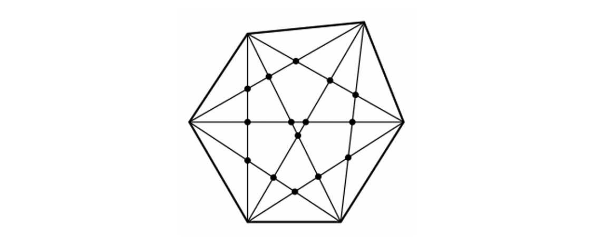

### SJECIŠTA

Xét một đa giác lồi có $N$ đỉnh, với tính chất bổ sung rằng không có ba đường chéo nào cắt nhau tại cùng một điểm. Hãy tìm số giao điểm giữa các cặp đường chéo trong đa giác đó.

Hình dưới đây minh họa một đa giác như vậy với $6$ đỉnh.



**Lưu ý:** Một đa giác được gọi là lồi nếu tất cả các góc bên trong của nó đều nhỏ hơn $180$ độ.

#### Input  
- Dòng đầu tiên và duy nhất chứa một số nguyên $N$, với $3 \leq N \leq 100$.

#### Output  
- In ra số giao điểm giữa các cặp đường chéo trên một dòng duy nhất.

#### Example  

!!! question "Test 1"  
    ???+ "Input"  
        ```sample  
        3  
        ```  
    ???+ success "Output"  
        ```sample  
        0  
        ```  

!!! question "Test 2"  
    ???+ "Input"  
        ```sample  
        4  
        ```  
    ???+ success "Output"  
        ```sample  
        1  
        ```  

!!! question "Test 3"  
    ???+ "Input"  
        ```sample  
        6  
        ```  
    ???+ success "Output"  
        ```sample  
        15  
        ```  