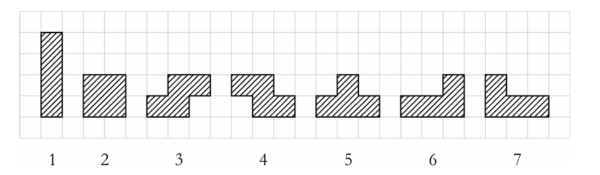
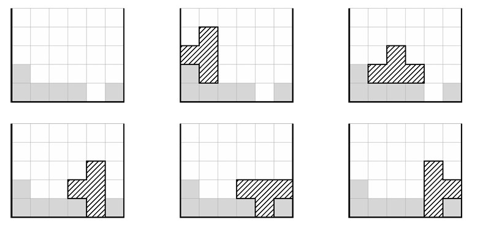

### TETRIS 

Tetris là một trò chơi máy tính phổ biến được chơi trên một sân gồm $C$ cột và số hàng không giới hạn. Trong mỗi lượt, một trong bảy khối hình sau sẽ được thả vào sân:



Người chơi có thể xoay khối 90, 180 hoặc 270 độ và di chuyển nó sang trái hoặc phải, miễn là khối nằm hoàn toàn trong sân. Sau đó, khối rơi xuống cho đến khi chạm vào đáy sân hoặc các ô đã bị chiếm. Trong biến thể Tetris của chúng ta, khối phải rơi xuống sao cho tất cả các phần của nó đều nằm trên đáy sân hoặc trên các ô đã bị chiếm. Nói cách khác, sau khi khối rơi xuống, không được có ô trống nào mà phía trên nó có ô bị chiếm.

Ví dụ, nếu sân có $6$ cột với độ cao ban đầu (số ô đã bị chiếm trong mỗi cột) lần lượt là $2, 1, 1, 1, 0, 1$, thì khối số $5$ có thể được thả theo $5$ cách khác nhau.



Bạn được cung cấp độ cao ban đầu của tất cả các cột và số hiệu của khối hình được thả xuống. Hãy viết chương trình tính số cách khác nhau có thể thả khối vào sân, tức là số cấu hình khác nhau của sân có thể đạt được sau khi thả khối.

#### Input
- Dòng đầu tiên chứa hai số nguyên $C$ và $P$ ($1 \leq C \leq 100$, $1 \leq P \leq 7$), lần lượt là số cột và số hiệu của khối hình được thả xuống.
- Dòng thứ hai chứa $C$ số nguyên cách nhau bởi dấu cách, mỗi số nằm trong khoảng từ $0$ đến $100$, biểu diễn độ cao ban đầu của các cột.

#### Output
- In ra một số nguyên duy nhất, là số cách khác nhau để thả khối vào sân.

#### Example

!!! question "Test 1"
    ???+ "Input"
        ```sample
        6 5
        2 1 1 1 0 1
        ```
    ???+ success "Output"
        ```sample
        5
        ```

!!! question "Test 2"
    ???+ "Input"
        ```sample
        5 1
        0 0 0 0 0
        ```
    ???+ success "Output"
        ```sample
        7
        ```

!!! question "Test 3"
    ???+ "Input"
        ```sample
        9 4
        4 3 5 4 6 5 7 6 6
        ```
    ???+ success "Output"
        ```sample
        1
        ```

